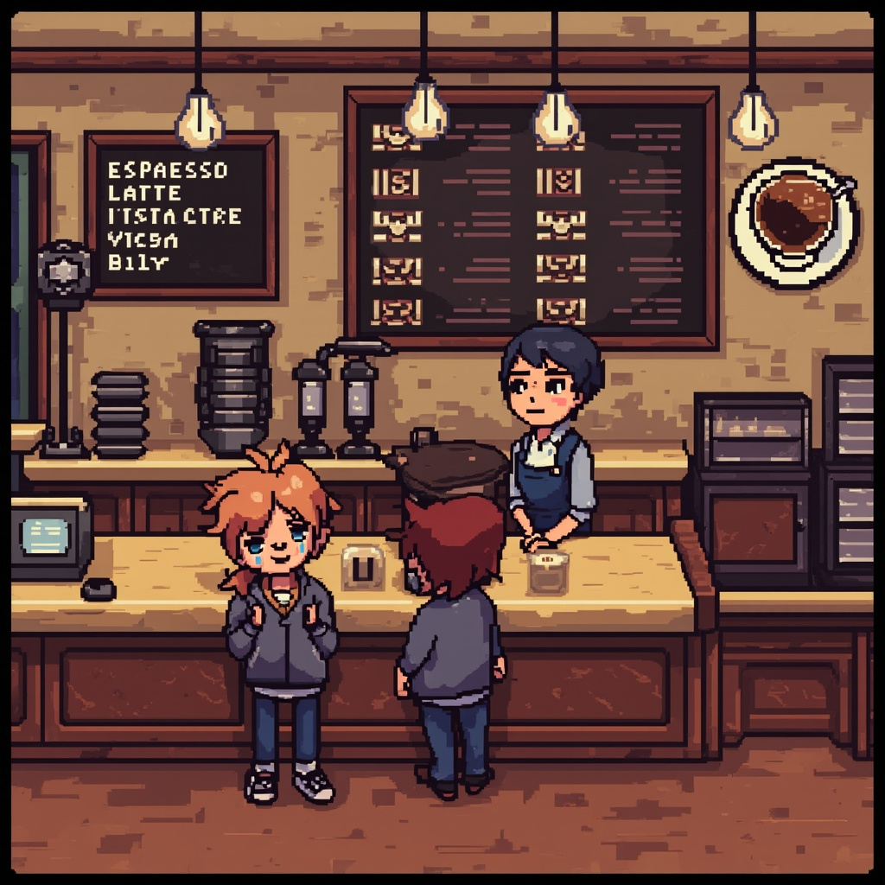

# Rare Friends Café

You run a coffee shop staffed by your Rare Friend NFT. The Friend's token ID determines barista skill, which affects drink quality and tip earnings. Five customers per shift, five menu items, real RF economy.

> Submitted to the [Rare Friends Vibeathon 2026](https://rarefriends.com/) — **Character Spotlight** category.



## TL;DR

- Pick your Rare Friend as the barista — their `tokenId` determines skill level (1-100)
- 5 customers per shift, each orders one of 5 drink types
- Brew the drink by spending the right amount of beans
- Customer satisfaction rolls via SDK chance game (preview mode, simulated)
- Friend skill adds a bonus to every tip (skill 1-100 → +0% to +20% tip)
- Tips = simulated RF earnings; spend beans (1 RF equivalent per bean) to keep brewing

## Project info

| Field | Value |
|---|---|
| Project name | Rare Friends Café |
| Builder | wudong6120415 |
| Contact | GitHub [@wudong6120415](https://github.com/wudong6120415) |
| Category | Character Spotlight |
| Submission path | `submissions/rare-friends-cafe/` |
| SDK | FriendSDK v0.1 |
| Deadline | September 30, 2026 |

## The experience

A Rare Friend NFT is the barista of your café. Connect your Robinhood mainnet wallet, choose your Friend, and they appear behind the counter with a skill badge. As customers arrive one by one, you read their order, brew the right drink with the right bean count, and watch their reaction.

Each drink has a base tip and a bean cost. The SDK's chance game rolls the customer satisfaction tier (Furious → Disappointed → Satisfied → Happy → Delighted). The Friend's skill level adds a permanent bonus to every tip.

## Menu

| Drink | Beans | Base Tip | When |
|---|---|---|---|
| Espresso | 1 | 0.20 RF | Quick orders |
| Latte | 2 | 0.50 RF | Standard |
| Cappuccino | 3 | 0.80 RF | Foam art |
| Mocha | 4 | 1.50 RF | Sweet tooths |
| Daily Special | 5 | 2.50 RF | Rare occasions |

## Satisfaction tiers

| Tier | Probability | Tip Multiplier |
|---|---|---|
| Furious | 5% | 0% |
| Disappointed | 15% | 20% |
| Satisfied | 40% | 50% |
| Happy | 30% | 100% |
| Delighted | 10% | 200% |

Final tip = `baseTip × tierMultiplier × (1 + skill/500)` for the Friend's skill 1-100.

## Barista skill (from token ID)

```
skill = Number(friendId % 100n) + 1
name =
  80-100: "Master Barista"
  50-79:  "Skilled Barista"
  25-49:  "Apprentice Barista"
  1-24:   "Novice Barista"
```

Every Friend has a unique skill. The café tells you who they are before you start.

## Files

| File | Purpose |
|---|---|
| `index.tsx` | Main game component: HUD, customer queue, brewing, reveal |
| `game.json` | Outcome table: 5 satisfaction tiers + weights |
| `style.css` | Café-themed UI: warm browns, cream backgrounds, barista avatar |
| `media/cafe-bg.jpg` | Café interior background (AI-generated) |
| `media/espresso.jpg` | Espresso cup art |
| `media/latte.jpg` | Latte glass art |
| `media/cappuccino.jpg` | Cappuccino cup art |
| `media/mocha.jpg` | Mocha art |
| `media/specialty.jpg` | Daily special art |
| `media/screenshot.jpg` | Composite README screenshot |

## How to run

### Prerequisites

- Linux or Ubuntu in WSL2 on Windows
- Node.js 22+
- npm
- Git
- Robinhood mainnet wallet holding a Generations NFT (gen 1+) for the wallet connection screen

### Setup

```sh
git clone https://github.com/wudong6120415/friendsdk.git
cd friendsdk
npm ci
node scripts/dev-game.mjs init games/rare-friends-cafe
cp submissions/rare-friends-cafe/* games/rare-friends-cafe/
npm run dev:game -- games/rare-friends-cafe
```

Open the displayed URL (normally `http://localhost:4173`), connect your wallet, choose your Friend, and start serving.

### Controls

| Input | Action |
|---|---|
| **Open shop** button | Start a customer order |
| **Brew** button | Serve the requested drink (deducts beans, plays the chance game) |
| Tab / Menu | Open settings (toggle mute, reduced-motion, view token id) |

## Checks (expected)

- `npm run typecheck` passes
- `npm run build` passes
- `npm run dev:game` boots at `localhost:4173`
- `npm test` passes

## Known limitations

- Player must hold a real Generations NFT for the wallet selection screen, even in preview.
- Robinhood mainnet RPC may rate-limit under heavy load.
- Drink art is AI-generated and may benefit from manual refinement.
- No multi-customer queueing (one customer at a time, by design).
- Bean economy is currently fixed (no upgrade system yet); preview economy only.
- Live mode (real RF settlements) is not enabled in this MVP.

## Future work

- **Day/night cycle**: open hours 6am-10pm, peak hours = bonus tips
- **Menu expansion**: seasonal drinks, unlockable via tokens spent
- **Barista outfits**: Friend appearance changes based on tip earnings tier
- **Customer memory**: regulars remember you (NPC state)
- **Live mode**: spend real RF on beans, settle real tips via SDK Dice

## Credits

- **FriendSDK v0.1** by spokesz — runtime, chance game, wallet, container
- **MiniMax-M3** — game design and code generation
- **MiniMax image-01** — drink and café artwork
- **Rare Friends** — theme and integration
